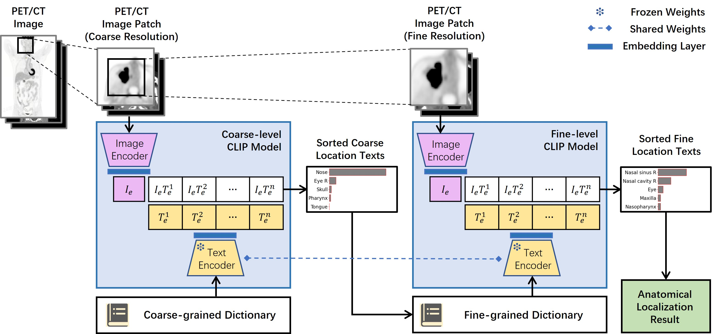

# HCL-AL
HCL-AL is a hierarchical image-to-text retrieval framework for whole-body anatomical localization in automated radiology report generation. Using CLIP, the framework aligns lesion image patches with textual descriptions of anatomical locations in a shared embedding space, achieving millisecond-level precise lesion localization across nearly 400 anatomical sites.

<!--  -->

Our work consists of the following modules:
- Main body of the framework
   - Code for full training and inference pipelines
   - Predefined anatomy knowledge

- Pretrained hierarchical localization model [Anatomical Localization Models](https://github.com/HerrBaum-YR/HCL-AL/releases/tag/v1.0.0-weights)
   - Coarse-grained and fine-grained CLIP pretrained models for lesion localization

- Newly released lesion localization annotations [Anatomical Localization Annotations](https://github.com/HerrBaum-YR/HCL-AL/releases/tag/v1.0.0-annotations)
   - The PET/CT scans and lesion annotations are sourced from the [Auto-PET challenge](https://autopet.grand-challenge.org/).
   - Some complex cases (number of lesions > 200) and false positives are excluded.
   - Each valid lesion was annotated with at least one precise anatomic localization tag (e.g., "Liver S1") following standardized radiological criteria.


# Quick Start
First, install this repo as a Python package. The following will do the trick:
```
git clone https://github.com/HerrBaum-YR/HCL-AL
cd HCL-AL
pip install -r requirements.txt
```

To quickly run localization inference, please download the required data and pretrained models:
- A publicly available collection of PET/CT scans released by [Auto-PET challenge](https://autopet.grand-challenge.org/)
- Curated lesion localization annotations [Anatomical Localization Annotations](https://github.com/HerrBaum-YR/HCL-AL/releases/tag/v1.0.0-annotations)
- Pretrained hierarchical localization models: [Anatomical Localization Models](https://github.com/HerrBaum-YR/HCL-AL/releases/tag/v1.0.0-weights)
and then organize them as follows:
```
HCL-AL
   ├── data
   │     ├── FDG-PET-CT-Lesions                               # Paired PET/CT scans (NIfTI format)                                     
   |     |    ├── 0001_PETCT_0011f3deaf_03-23-2003-NA-PET-CT_Ganzkoerper__primaer_mit_KM-10445
   |     |    |     ├── CT.nii.gz
   |     |    |     └── SUV.nii.gz
   |     |    └── ...
   |     ├── lesion_mask                                      # Multi-label lesion segmentation masks (NIfTI format)  
   |     |    ├── 0001_PETCT_0011f3deaf_03-23-2003-NA-PET-CT_Ganzkoerper__primaer_mit_KM-10445
   |     |    |     └── SEG_MultiLabel.nii.gz
   |     |    └── ...
   |     ├── anno.csv                                         # Curated lesion localization annotations
   |     └── bbox.csv                                         # Bounding box coordinates of annotated lesions
   ├── pretrained_weights                                   # Pretrained models
   └── md_clip3d                                            # Main body of framework
         ├── library                                           # Predefined anatomy knowledge                                        
         |   ├── anatomy_vocabulary_library.json               # Hierarchical anatomical vocabulary library
         |   └── augmented_location_descriptions.json          # Augmented anatomical location description
         └── ...
```

Then create your inference configuration file. We provide a reference template at:
```
md_clip3d
   └── config                                          
         ├── coarse_train_config.py                        Reference for coarse training
         ├── fine_train_config.py                          Reference for fine training
         └── inference_config.py                           Reference for inference ★
```
Simply set the correct <project_path> if you've followed our default directory structure, or manually specify custom paths for models and data as needed - the system will automatically handle the rest once these locations are correctly configured.

Now you can run the following to perform model inference:
```
clip_apply -i ./your_inference_config.py
```

# Train Your Own Model
For most applications, we recommend training a cascaded localization model (coarse-to-fine) for optimal accuracy. However, if your task is relatively simple, a single coarse-grained model may suffice.
Below we demonstrate using the cascaded training approach as an example.

- Configure & Train Stage 1 (Coarse Localization)
   - Create your coarse-stage training config (e.g., configs/coarse.yaml)
   - Run coarse training
   ```
   clip_coarse_train -i ./coarse_train_config.py
   ```
- Generate Stage 1 Predictions
   - Before training Stage 2, run inference on your training set:
   ```
   clip_apply -i ./coarse_inference_config.py
   ```
- Configure & Train Stage 2 (Fine Localization)
   - Update your fine-stage config training to use Stage 1 predictions as training inputs:
   - Run fine training
   ```
   clip_fine_train -i ./fine_train_config.py
   ```