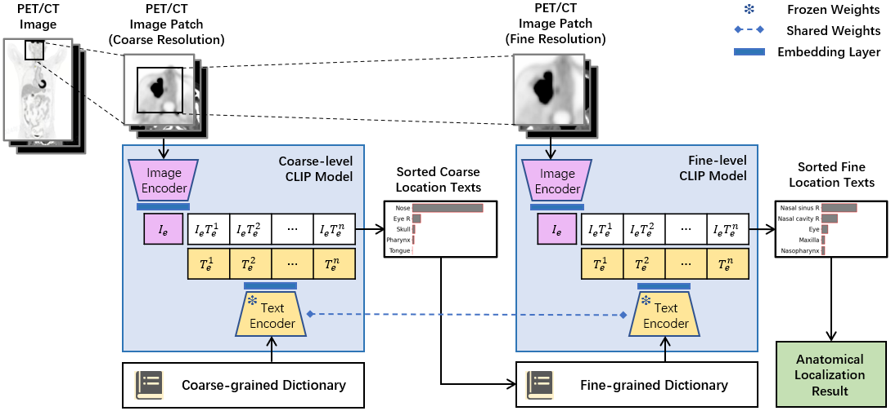

# HCL-AL
HCL-AL is a hierarchical image-to-text retrieval framework for whole-body anatomical localization in automated radiology report generation. Using CLIP, the framework aligns lesion image patches with textual descriptions of anatomical locations in a shared embedding space, achieving millisecond-level precise lesion localization across nearly 400 anatomical sites.



# Releases
We have open-sourced the following components in addition to the core framework.
- Anatomical Localization Models (https://github.com/HerrBaum-YR/HCL-AL/releases/tag/v1.0.0-weights)
   - Coarse-grained and fine-grained CLIP pretrained models for lesion localization

- Anatomical Localization Annotations (https://github.com/HerrBaum-YR/HCL-AL/releases/tag/v1.0.0-annotations)
   - The lesion annotations are sourced from the [AutoPET dataset] (https://autopet.grand-challenge.org/).
   - Some complex cases (number of lesions > 200) and false positives are excluded.
   - Each valid lesion was annotated with at least one precise anatomic localization tag (e.g., "Liver S1") following standardized radiological criteria.

# Quick Start
- Install framework
```
git clone https://github.com/HerrBaum-YR/HCL-AL
cd HCL-AL

pip install -r requirements.txt
```
- Key configuration files are described as follows
```
   md_clip3d        
   ├── config     
   |   ├── coarse_train_config.py                        Reference configuration file for coarse training
   |   ├── fine_train_config.py                          Reference configuration file for fine training
   |   └── inference_config.py                           Reference configuration file for inference
   └── library    Predefined anatomical knowledge
       ├── anatomy_vocabulary_library.json               Hierarchical anatomical vocabulary library
       └── augmented_location_descriptions.json          Augmented anatomical location description
```

- Download pre-trained models and annotations in our releases

# Model Inference
- Configure the inference configuration file
- Perform inference
```
clip_apply -i ./inference_config.py
```

# Model Trainig
- Configure the coarse train configuration file [coarse_train_config.py]
- Perform coarse-grained model training
```
clip_coarse_train -i ./coarse_train_config.py
```
- Perform coarse-grained model inference for fine-grained model training
- Configure the fine train configuration file [fine_train_config.py]
- Perform fine-grained model training
```
clip_fine_train -i ./fine_train_config.py
```
